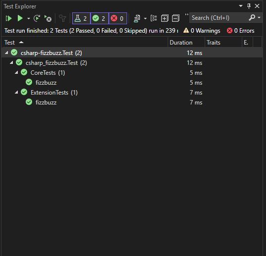

# csharp-fizzbuzz

## Learning Objectives
- Implement a program that uses a class, data of different types stored in variables, loops and conditional statements

## Set up instructions
- Fork this repository and clone the forked version to your machine
- Open the csharp-fizzbuzz.sln folder
- observe 2 projects, Main and Test.
- Implement the requirements listed in comments in the `Core.cs` file.  Also see the TODOs on the Task List.
- When ready to test your solution, open the Test Explorer click "Run" button, or you can right click an individual test (or a group) to run, debug.

